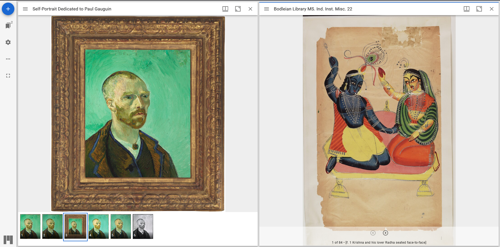
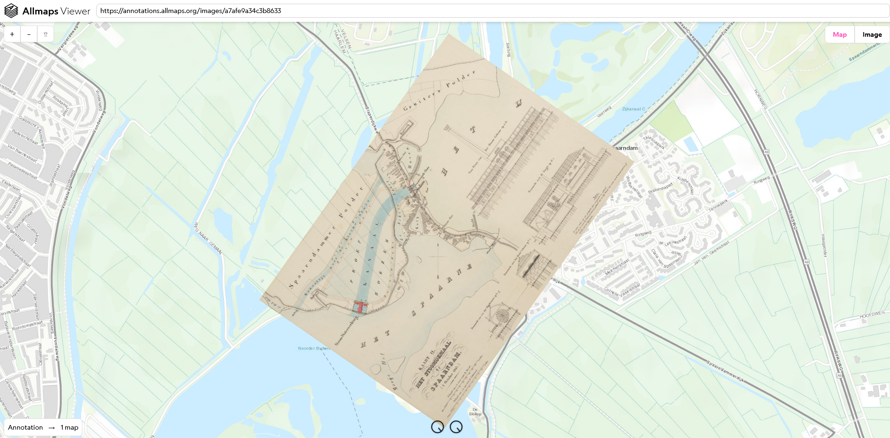

# IIIF 

IIIF is a set of standards for serving images and other media over the internet. In this case, a 'standard' is a predefined and agreed procedure - here it specifies what data is transmitted, and how it is written. 

IIIF documents, typically called manifests, are generally written in json, a typical format for transmitting data over the internet. JSON documents follow the key-value pair format; the IIIF standard specifies what keys are required, what additional keys are available, and what the values associated with these keys can be. This makes the content of IIIF manifests predictable, allowing the easy creation of viewers and other tools, and reliable transfer of information. 

## Examples of IIIF in use

There are already a number of examples of IIIF in use, with a variety of different viewers available, and in a number of different organisations and projects.

### Viewers

- [Project Mirador.](https://projectmirador.org/) 

Project Mirador is a large, complete viewer, capable of displaying most forms of IIIF content. It is designed to be flexible, and is in use by a number of different projects. 

- [Clover IIIF](https://samvera-labs.github.io/clover-iiif/) 

Clover is a viewer designed to run on the React framework, allowing easy integration into a wide number of websites due to React's popularity. 

- All Maps

IIIF manifests allow for tiled images, with functionality to zoom into great detail, or pan across larger images. There are also provisions for including georeferences. This lends particular utility to displaying maps, in particular overlaying different maps on a base. Allmaps is a viewer designed to take advantage of this. 

### Projects using IIIF

There are a number of different projects using IIIF to present their data, over a range of different subjects. A few examples include:

- [Bodleian Library]() The Digital Bodleian project is the digital form of the Bodleian library, using IIIF to present their collections. Digital artifacts are made available in IIIF form, allowing their use in a number of different viewers - for example see [this item](https://digital.bodleian.ox.ac.uk/objects/97b469e5-e0f9-459c-871e-ba71c2ad60ae/), which is also viewable directly [in Mirador](https://iiif.bodleian.ox.ac.uk/iiif/mirador/?iiif-content=https://iiif.bodleian.ox.ac.uk/iiif/manifest/97b469e5-e0f9-459c-871e-ba71c2ad60ae.json).

- [Getty](https://experiments.getty.edu/ac-art-generator/) The Getty is using the interoperability of IIIF as a way to allow users to choose artwork from their collection or others, and import it into the game Animal Crossing.

- [RBGE herbarium](https://rbge.org.uk/) - IIIF is in use outside of just the humanities; for example the Royal Botanic Gardens Edinburgh are in the process of digitising their herbarium, and are using IIIF to serve the images. 

### Other tools

- [Miiify](https://miiify.org/) - One of many IIIF tools; in this case storing and serving IIIF manifests using GitHub as a backend.

## Advantages of IIIF

- Mixing of resources. The key advantage of IIIF is that it allows you to mix and match resources from different sources - the resource does not actually leave the original host, the manifest simply tells the viewer where to find it. This, for example, lets you build a manifest that tells the story of ships voyage: drawing the details of the log from TNA's collection, with relevant art from the National Gallery, and maps from the National Library of Scotland (assuming the resources are available). 

- Adoption. IIIF is already in use in a number of different projects, as demonstrated above. Combined with its interoperability due to its standardised format, this provides a set of already-existing resources, and confidence in likely longevity of the standard.

## APIs

IIIF defines a few different standards (APIs), which are designed to be combined, allowing flexibility in their use. Two of these APIs are detailed here in these notebooks - [presentation](https://iiif.io/api/presentation/3.0/) and [image](https://iiif.io/api/image/3.0/).  
The image API is provides tools for serving image-resources. It specifies how different URIs can be constructed to request different views of the same resource, such as different zoom levels or regions. It also specifies how metadata about a resource should be structured and presented to the user when requested.    
The presentation API specifies how one or more resources should be presented, along with their structure, metadata, and data such as annotations. For example, a presentation API manifest may show each page of a book, using the image API to form requests for images of each page. Manifests built by the presentation API are the main style of IIIF resource, and what you are most likely to encounter. 
IIIF defines other APIs to allow further functionality, such as [search](https://iiif.io/api/search/2.0/) or [authorisation](https://iiif.io/api/auth/2.0/).

## Notebooks

The two notebooks presented here work through the [Presentation](./presentation_api.ipynb) and [Image](image_api.ipynb) APIs, as they are the most likely to be encountered. They both work with the same example document from Discovery, building a hypothetical IIIF manifest from the data available, with the aim of understanding what values are required, and how they should be formatted. The image API notebook also dissects some live examples, to see what values have been used, and what the effect of changing them is.